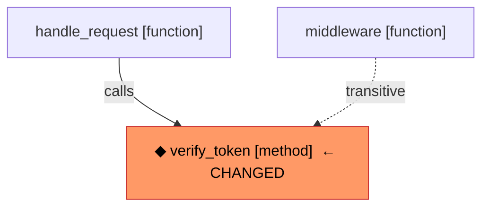

# Beginner's Guide to code-indexer

> **Who this is for:** You want to understand what this project does and how
> all the recent features fit together.  No intermediate coding knowledge
> assumed — just curiosity.

---

## Table of Contents

1. [What problem does this project solve?](#1-what-problem-does-this-project-solve)
2. [The two ways of understanding code](#2-the-two-ways-of-understanding-code)
3. [The graph — a map of your codebase](#3-the-graph--a-map-of-your-codebase)
4. [Nodes — the things on the map](#4-nodes--the-things-on-the-map)
5. [Edges — the connections between things](#5-edges--the-connections-between-things)
6. [Feature: INJECTS edges — who depends on whom?](#6-feature-injects-edges--who-depends-on-whom)
7. [Feature: Decorators — sticky labels on symbols](#7-feature-decorators--sticky-labels-on-symbols)
8. [Feature: Mermaid diagrams — pictures of the graph](#8-feature-mermaid-diagrams--pictures-of-the-graph)
9. [Feature: Katz centrality — finding the most important code](#9-feature-katz-centrality--finding-the-most-important-code)
10. [Feature: Context packing — fitting the best code into a limited space](#10-feature-context-packing--fitting-the-best-code-into-a-limited-space)
11. [How all the features work together](#11-how-all-the-features-work-together)
12. [Glossary](#12-glossary)

---

## 1. What problem does this project solve?

Imagine you have a codebase with **10 000 files and 500 000 lines of code**.
You want to ask an AI assistant: *"How does user authentication work?"* or
*"If I change this function, what will break?"*

The AI can only read a small window of text at a time (its **context window**,
typically 8 000–128 000 tokens — think of it like short-term memory).  It
cannot read all 500 000 lines at once.

**code-indexer** solves this by:

1. Reading your whole codebase once and building an **index** — a compact
   structured summary.
2. When you ask a question, it **retrieves** only the most relevant pieces
   and feeds them to the AI.
3. The AI now has focused, high-quality context instead of random snippets.

This is called **RAG** — Retrieval-Augmented Generation.

---

## 2. The two ways of understanding code

The project uses **two completely different techniques** to understand code,
and combines them:

### Way 1 — Vector search (semantic similarity)

Think of this like Google search but for code.

- Every function and class is converted into a list of numbers (a **vector
  embedding**) that captures its *meaning*.
- When you search for "authentication logic", the system finds code whose
  meaning is close to that phrase — even if it doesn't contain those exact
  words.
- Good at answering: *"What code is conceptually similar to my question?"*

### Way 2 — Graph search (structural relationships)

Think of this like a family tree or a city map for your code.

- The system reads every file and records **who calls whom**, **who imports
  whom**, **who inherits from whom**.
- This creates a network (a **graph**) of connections.
- Good at answering: *"If I change X, what else will break?"* and *"What
  does class Y depend on?"*

Neither approach alone is enough.  Vector search finds semantically similar
code but doesn't know about dependencies.  Graph search knows about
dependencies but can't answer vague semantic questions.  **Together they are
much more powerful.**

```
Your question
     │
     ├─── Vector search ──► "semantically similar functions"
     │                               │
     └─── Graph search  ──► "structurally related code"      ──► AI gets
                                     │                             best of
                              Combined & ranked                   both worlds
```

---

## 3. The graph — a map of your codebase

The graph is the heart of this project.  Think of it as a **city map**:

- **Cities** (nodes) = individual pieces of code (files, functions, classes)
- **Roads** (edges) = relationships between them ("A calls B", "C imports D")

When you index a codebase, the system:

1. Reads every source file using a tool called **Tree-sitter** (a fast,
   accurate code parser — like a grammar checker for code).
2. Extracts all the "cities" and "roads".
3. Stores them in either an in-memory store (like a whiteboard) or Neo4j
   (like a proper database built for graphs).

---

## 4. Nodes — the things on the map

A **node** is any named thing in your code.  There are three kinds:

### FileNode — a source file

```
FileNode {
  path: "src/auth/jwt.py"
  language: Python
  sha256: "abc123..."   ← fingerprint for change detection
}
```

### SymbolNode — a named piece of code

This is the most important kind.  A symbol is any function, class, method,
enum, or variable that has a name.

```
SymbolNode {
  name: "verify_token"
  qualified_name: "src/auth/jwt.py::JWTHandler.verify_token"
  kind: "method"
  file_path: "src/auth/jwt.py"
  start_line: 42
  end_line: 89
  decorators: ["router.get"]   ← NEW: labels applied to this symbol
}
```

### DirectoryNode — a folder

```
DirectoryNode {
  path: "src/auth"
  name: "auth"
}
```

---

## 5. Edges — the connections between things

An **edge** is a directed connection (like a one-way road) between two nodes.
Each edge has a **type** that says what kind of relationship it is.

| Edge type | Meaning | Example |
|---|---|---|
| `IMPORTS` | File A imports file B | `jwt.py` imports `utils.py` |
| `DEFINES` | File A defines symbol B | `jwt.py` defines `verify_token` |
| `CONTAINS` | Class A contains method B | `JWTHandler` contains `verify_token` |
| `CALLS` | Function A calls function B | `handle_request` calls `verify_token` |
| `INHERITS_FROM` | Class A extends class B | `AdminHandler` inherits `BaseHandler` |
| `INJECTS` | Class A depends on class B as a constructor argument | `OrderService` injects `UserRepository` |
| `REFERENCES` | Symbol A mentions symbol B | General code reference |
| `PART_OF` | File/directory belongs to a directory | `jwt.py` is part of `src/auth/` |

---

## 6. Feature: INJECTS edges — who depends on whom?

### The problem it solves

Imagine this Python code:

```python
class OrderService:
    def __init__(self, repo: OrderRepository, mailer: EmailService):
        self.repo = repo
        self.mailer = mailer
```

`OrderService` **depends** on `OrderRepository` and `EmailService`.  If you
change `OrderRepository`, `OrderService` might break — but the call graph
would miss this because `OrderService` doesn't *call* `OrderRepository`
directly, it just *holds a reference to it*.

Before this feature: the graph only knew about `CALLS` edges.  It would
**miss** this dependency entirely.

### What INJECTS does

The system now reads constructor parameters and typed class fields and
creates `INJECTS` edges:

```
OrderService ──[INJECTS {field_name: "repo"}]──► OrderRepository
OrderService ──[INJECTS {field_name: "mailer"}]─► EmailService
```

Now if you run impact analysis asking *"what breaks if I change
OrderRepository?"*, `OrderService` correctly appears in the results.

### Where it works

| Language | What it detects |
|----------|----------------|
| **Python** | `def __init__(self, repo: UserRepository)` and `field: Type` class annotations |
| **TypeScript** | `constructor(private readonly svc: UserService)` |
| **Java** | `@Autowired private UserRepository repo` and `@Autowired` constructors |

### Real-world analogy

Think of a coffee shop.  The barista (`OrderService`) **depends on** a coffee
machine (`OrderRepository`).  If you replace the coffee machine with a
different model, the barista's job changes — even if they never "call" the
machine by name in a conversation.  `INJECTS` captures this structural
dependency that pure call graphs miss.

---

## 7. Feature: Decorators — sticky labels on symbols

### What are decorators?

In Python, decorators are the `@something` lines that appear right above a
function or class:

```python
@app.route("/login")           # Flask route
@pytest.fixture                # Test fixture
@cache(timeout=300)            # Caching
@staticmethod                  # Built-in
def login_handler(): ...
```

Java has annotations (`@Autowired`, `@Override`), TypeScript has decorators
(`@Injectable()`, `@Component()`).  They're all **labels** that modify or
categorise a symbol.

### Why store them?

Before this feature: if you wanted to find all API route handlers in your
codebase, you had no way to filter for them — you'd have to read every
function.

After this feature: every `SymbolNode` carries a `decorators` list:

```python
sym.decorators  # ["app.route", "login_required"]
```

You can now filter by decorator:

```python
# Find all FastAPI route handlers
routes = [s for s in symbols if any(d.startswith("router.") for d in s.decorators)]

# Find all Celery background tasks
tasks = [s for s in symbols if "shared_task" in s.decorators]

# Find all pytest fixtures
fixtures = [s for s in symbols if "pytest.fixture" in s.decorators]
```

In Neo4j, this becomes a simple database query:

```cypher
MATCH (s:Symbol)
WHERE 'pytest.fixture' IN s.decorators
RETURN s.qualified_name, s.file_path
```

### How they are stored

The `@` and any call arguments are stripped so they're clean to compare:

| Raw decorator | Stored as |
|---|---|
| `@pytest.mark.skip(reason="x")` | `"pytest.mark.skip"` |
| `@router.get("/users")` | `"router.get"` |
| `@staticmethod` | `"staticmethod"` |
| `@Injectable()` | `"Injectable"` |

---

## 8. Feature: Mermaid diagrams — pictures of the graph

### What is Mermaid?

Mermaid is a simple text format that GitHub, Notion, and many other tools
render as visual diagrams.  Instead of writing an image file, you write a
short text description and it becomes a flowchart automatically.

### Why add Mermaid output?

When an AI assistant is trying to understand your code, reading dozens of
function names in a list is hard to parse.  A visual diagram showing *who
calls whom* makes the structure immediately obvious — even to an AI.

This project adds `.to_mermaid()` methods to two result types:

### `SymbolContext.to_mermaid()` — neighbourhood view

Shows everything around a single symbol: what calls it, what it calls, what
class it belongs to, and what it inherits from.

```python
ctx = store.get_symbol_context(sym.id)
print(ctx.to_mermaid())
```

Output:

```mermaid
flowchart TD
    _self["verify_token [method]"]
    _caller_0["handle_request [function]"]
    _caller_0 -->|calls| _self
    _callee_0["decode_jwt [function]"]
    _self -->|calls| _callee_0
    _parent["JWTHandler [class]"]
    _parent -->|contains| _self
    _base_0["BaseHandler [class]"]
    _self -->|inherits| _base_0
```

Which renders as a proper flowchart in any Mermaid-aware viewer.

### `ImpactResult.to_mermaid()` — blast radius view

Shows what would break if you change a symbol.  The changed symbol is
highlighted in orange.  Direct callers use solid arrows; indirect callers
use dashed arrows.

```python
impact = store.get_impact_set(sym.id, min_confidence=0.5)
print(impact.to_mermaid())
```

Output:



### Real-world analogy

Imagine you're explaining to a new team member how the authentication system
works.  You could read them a list of 20 function names — or you could draw
a quick diagram on a whiteboard.  The diagram takes 10 seconds to understand
vs 5 minutes for the list.  `to_mermaid()` gives the AI the whiteboard.

---

## 9. Feature: Katz centrality — finding the most important code

### What is centrality?

In any network, some nodes are more **central** than others.  In a road
network, the town square is more central than a dead-end alley.  In a social
network, a celebrity is more central than a random person.

In a codebase, some functions are called by *everything else*.  If you change
them, the whole system is affected.  These are the architectural hotspots.

### What is Katz centrality specifically?

Katz centrality is a mathematical formula that scores each node based on
how many other nodes depend on it — directly *and* indirectly.

The formula (you don't need to memorise this, just the intuition):

```
score(symbol) = (number of things that directly call it)
              + α × (number of things that call those callers)
              + α² × (number of things that call those callers' callers)
              + ...
```

Where `α` (alpha) is a small number like 0.1 that makes each hop matter a
bit less than the previous one.  This prevents distant, tenuous connections
from swamping the score.

### Why is this useful?

It answers: *"Which functions are the architectural backbone of this
codebase?"*

```python
katz = snapshot.compute_katz_centrality()

# Top 5 hotspots
top5 = sorted(katz.items(), key=lambda x: x[1], reverse=True)[:5]
for sym_id, score in top5:
    sym = snapshot.symbol_nodes[sym_id]
    print(f"  {score:.2f}  {sym.name}  ({sym.file_path})")

# Example output:
#   1.00  verify_token      (src/auth/jwt.py)
#   0.89  Session.execute   (src/db/session.py)
#   0.74  get_current_user  (src/auth/deps.py)
#   0.61  send_response     (src/api/base.py)
#   0.55  log_event         (src/monitoring.py)
```

These are the functions you should be most careful about changing, most
thorough about testing, and most likely to include in any AI-assisted code
review.

### Inspired by

The `entity_rank` use-case in the `code-chopper` library shown in the
r/LocalLLaMA Reddit thread — which used Katz centrality to rank functions in
exactly this way.

### Edges used

The system considers three kinds of dependencies for the centrality
calculation:

- `CALLS` — someone calls this function
- `INJECTS` — someone injects this class as a dependency
- `INHERITS_FROM` — someone extends this class

If many things call AND inject AND inherit from the same symbol, it scores
very high.

---

## 10. Feature: Context packing — fitting the best code into a limited space

### The core problem

An AI assistant has a **context window** — the maximum amount of text it can
read at once.  Think of it like a physical desk: you can only have so many
papers on it at a time.

When you retrieve candidate symbols to show the AI, you might find 50
relevant functions.  But the AI's desk only fits 10 of them.  Which 10 do
you choose?

**Naive approach:** take the top 10 by score.
**Problem:** this is wrong because functions have different sizes.  A tiny
helper function (5 lines ≈ 75 tokens) is "cheaper" than a large class (200
lines ≈ 3000 tokens).  You might fit 8 tiny helpers OR 1 large class in the
same space.  If the large class is the most relevant, you want it in —
but if 5 helpers together are more relevant than the class, take those.

### The knapsack problem

This is a classic computer science puzzle called the **0/1 knapsack problem**:

> You're going on a camping trip with a backpack that holds 15 kg.
> You have 20 items, each with a weight and a usefulness score.
> You can either take each item or leave it.
> Which items do you pack to maximise total usefulness without exceeding 15 kg?

Translated to our problem:

| Camping | Code context |
|---------|-------------|
| Backpack weight limit | Token budget (e.g. 8 192 tokens) |
| Item weight | Estimated token cost of a symbol |
| Item usefulness | Relevance score of a symbol |
| Goal | Maximise total relevance within budget |

### How the token cost is estimated

We don't need the actual source code.  We estimate:

```
token cost = (end_line − start_line + 1) × 15
```

15 tokens per line is a good average for Python, TypeScript, and Java.
A 20-line function costs ~300 tokens.  A 200-line class costs ~3 000 tokens.

### The two algorithms

**Greedy (default, fast)**

Sort all candidates by `score ÷ token_cost` (value per token, like price per
kilogram at a supermarket).  Then greedily pick the most efficient ones until
the budget is full.

- Speed: O(n log n) — very fast even for thousands of candidates
- Accuracy: gets within 95–99% of the perfect answer in practice
- Use this: always, unless you specifically need perfect optimality

**DP / Dynamic Programming (exact, slower)**

Tries every possible combination systematically (but cleverly avoids
repeating work).  Guarantees the mathematically perfect answer.

- Speed: O(n × budget ÷ 64) — slower, but still milliseconds for typical use
- Accuracy: 100% optimal
- Use this: when the budget is very tight (under 2 000 tokens) and you need
  every token to count

### Example

```python
from code_indexer.graph.context_packer import ContextPacker

packer = ContextPacker()

# candidates = [(SymbolNode, relevance_score), ...]
packed = packer.pack(candidates, token_budget=8192)

print(packed.summary())
# PackedContext: 14 symbols, 7841/8192 tokens (96% utilization), 6 dropped
#                  ↑ how many fit   ↑ how full   ↑ how many didn't fit

# The selected symbols, best first:
for sym, score in zip(packed.symbols, packed.scores):
    print(f"  {score:.2f}  {sym.name}  ({sym.start_line}–{sym.end_line} lines)")
```

### Inspired by

A comment in the r/LocalLLaMA Reddit thread on `code-chopper`:
> *"knapsack optimization so you only load the optimal context for the agent"*

---

## 11. How all the features work together

Here's the complete pipeline from a user question to an AI answer:

```
User asks: "How does authentication work?"
                │
                ▼
        ┌───────────────┐
        │ Vector Search │  ← finds semantically similar functions
        │               │    using embedding similarity
        └───────┬───────┘
                │  50 candidate symbols
                ▼
        ┌───────────────────────────────┐
        │       Score Enhancement       │
        │                               │
        │  final_score =                │
        │    0.6 × vector_similarity    │  ← how semantically relevant
        │  + 0.4 × katz_centrality      │  ← how architecturally important
        └───────────────┬───────────────┘
                        │  50 candidates, each with a blended score
                        ▼
        ┌───────────────────────────────┐
        │       Context Packer          │  ← knapsack algorithm
        │                               │
        │  token_budget = 8 192         │
        │  strategy = "greedy"          │
        │                               │
        │  selects best 14 symbols      │
        │  that fit in 7 841 tokens     │
        └───────────────┬───────────────┘
                        │
          ┌─────────────┴─────────────┐
          │                           │
          ▼                           ▼
   ┌─────────────┐           ┌──────────────────┐
   │  to_mermaid │           │  to_context_text │
   │  (topology) │           │  (ranked list)   │
   └──────┬──────┘           └────────┬─────────┘
          │                           │
          └──────────┬────────────────┘
                     │
                     ▼
              LLM prompt:
              ┌─────────────────────────────────────┐
              │ [Mermaid diagram: who calls whom]    │
              │                                      │
              │ [14 most relevant symbols + scores]  │
              │                                      │
              │ User question: "How does auth work?" │
              └─────────────────────────────────────┘
                     │
                     ▼
              AI gives a focused, accurate answer
              grounded in the actual code structure
```

### Where INJECTS and decorators fit in

- **INJECTS edges** make the graph richer.  When Katz centrality runs, it
  now counts CALLS + INJECTS + INHERITS_FROM edges.  A class that everything
  depends on *via injection* (like a database session class) gets a high score
  even if nothing explicitly *calls* it.

- **Decorators** let you pre-filter candidates before they even reach the
  packer.  For example, if the user is asking about API endpoints, you can
  restrict to symbols with `router.get` or `app.route` decorators before
  scoring — reducing noise and improving relevance.

```python
# Only consider route handlers for API questions
api_candidates = [
    (sym, score)
    for sym, score in all_candidates
    if any(d.startswith("router.") for d in sym.decorators)
]
packed = packer.pack(api_candidates, token_budget=8192)
```

---

## 12. Glossary

| Term | Plain English |
|------|---------------|
| **RAG** | Retrieval-Augmented Generation — asking an AI using retrieved snippets as context |
| **Context window** | The maximum text an AI can read at once (like short-term memory) |
| **Token** | A chunk of text, roughly 0.75 words on average |
| **Embedding / vector** | A list of numbers that represents the "meaning" of some text |
| **Graph** | A network of nodes connected by edges |
| **Node** | A thing in the graph (file, function, class) |
| **Edge** | A directed connection between two nodes |
| **CALLS edge** | "Function A calls function B" |
| **INJECTS edge** | "Class A depends on class B as a constructor argument" |
| **Decorator** | `@something` label on a function or class |
| **Katz centrality** | A score measuring how many things transitively depend on a symbol |
| **Knapsack problem** | Pick the most valuable items that fit in a limited-size bag |
| **Context packer** | Uses the knapsack algorithm to select the best symbols that fit the token budget |
| **Tree-sitter** | A fast code parser that reads source files and extracts structure |
| **Mermaid** | A text format that renders as visual diagrams in GitHub/Notion/etc. |
| **Neo4j** | A graph database — stores nodes and edges, supports Cypher queries |
| **Cypher** | The query language for Neo4j (like SQL but for graphs) |
| **Symbol** | Any named piece of code: function, class, method, variable |
| **Qualified name** | The full dotted path to a symbol: `src/auth/jwt.py::JWTHandler.verify_token` |
| **Power iteration** | The math trick used to compute Katz centrality by repeatedly refining estimates |
| **Value density** | `score ÷ token_cost` — used by the greedy packer to rank items |
| **Impact analysis** | "If I change X, what else might break?" |
