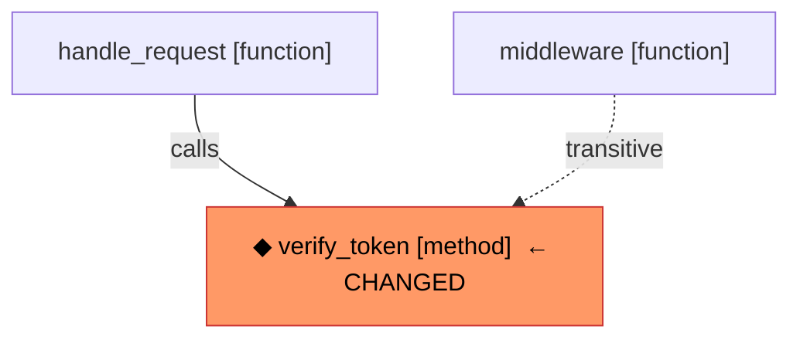

# Beginner's Guide to code-indexer

> **Who this is for:** You want to understand what this project does and how
> all the recent features fit together.  No intermediate coding knowledge
> assumed — just curiosity.

---

## Table of Contents

1. [What problem does this project solve?](#1-what-problem-does-this-project-solve)
2. [The two ways of understanding code](#2-the-two-ways-of-understanding-code)
3. [The graph — a map of your codebase](#3-the-graph--a-map-of-your-codebase)
4. [Nodes — the things on the map](#4-nodes--the-things-on-the-map)
5. [Edges — the connections between things](#5-edges--the-connections-between-things)
6. [Feature: INJECTS edges — who depends on whom?](#6-feature-injects-edges--who-depends-on-whom)
7. [Feature: Decorators — sticky labels on symbols](#7-feature-decorators--sticky-labels-on-symbols)
8. [Feature: Mermaid diagrams — pictures of the graph](#8-feature-mermaid-diagrams--pictures-of-the-graph)
9. [Feature: Katz centrality — finding the most important code](#9-feature-katz-centrality--finding-the-most-important-code)
10. [Feature: Context packing — fitting the best code into a limited space](#10-feature-context-packing--fitting-the-best-code-into-a-limited-space)
11. [The vocabulary gap — why code search often fails](#11-the-vocabulary-gap--why-code-search-often-fails)
12. [Feature: split_identifier — reading compound words in code](#12-feature-split_identifier--reading-compound-words-in-code)
13. [Feature: TermEnricher — translating code shorthand to plain English](#13-feature-termenricher--translating-code-shorthand-to-plain-english)
14. [Feature: TermChunk — slicing functions by topic](#14-feature-termchunk--slicing-functions-by-topic)
15. [Feature: ConcernClusterer — grouping scattered code into named themes](#15-feature-concernclusterer--grouping-scattered-code-into-named-themes)
16. [Feature: Concern blocks — giving the AI a map before it explores](#16-feature-concern-blocks--giving-the-ai-a-map-before-it-explores)
17. [The LLM client — the engine behind enrichment and clustering](#17-the-llm-client--the-engine-behind-enrichment-and-clustering)
18. [How all the features work together (full pipeline)](#18-how-all-the-features-work-together-full-pipeline)
19. [Glossary](#19-glossary)

---

## 1. What problem does this project solve?

Imagine you have a codebase with **10 000 files and 500 000 lines of code**.
You want to ask an AI assistant: *"How does user authentication work?"* or
*"If I change this function, what will break?"*

The AI can only read a small window of text at a time (its **context window**,
typically 8 000–128 000 tokens — think of it like short-term memory).  It
cannot read all 500 000 lines at once.

**code-indexer** solves this by:

1. Reading your whole codebase once and building an **index** — a compact
   structured summary.
2. When you ask a question, it **retrieves** only the most relevant pieces
   and feeds them to the AI.
3. The AI now has focused, high-quality context instead of random snippets.

This is called **RAG** — Retrieval-Augmented Generation.

---

## 2. The two ways of understanding code

The project uses **two completely different techniques** to understand code,
and combines them:

### Way 1 — Vector search (semantic similarity)

Think of this like Google search but for code.

- Every function and class is converted into a list of numbers (a **vector
  embedding**) that captures its *meaning*.
- When you search for "authentication logic", the system finds code whose
  meaning is close to that phrase — even if it doesn't contain those exact
  words.
- Good at answering: *"What code is conceptually similar to my question?"*

### Way 2 — Graph search (structural relationships)

Think of this like a family tree or a city map for your code.

- The system reads every file and records **who calls whom**, **who imports
  whom**, **who inherits from whom**.
- This creates a network (a **graph**) of connections.
- Good at answering: *"If I change X, what else will break?"* and *"What
  does class Y depend on?"*

Neither approach alone is enough.  Vector search finds semantically similar
code but doesn't know about dependencies.  Graph search knows about
dependencies but can't answer vague semantic questions.  **Together they are
much more powerful.**

```
Your question
     │
     ├─── Vector search ──► "semantically similar functions"
     │                               │
     └─── Graph search  ──► "structurally related code"      ──► AI gets
                                     │                             best of
                              Combined & ranked                   both worlds
```

---

## 3. The graph — a map of your codebase

The graph is the heart of this project.  Think of it as a **city map**:

- **Cities** (nodes) = individual pieces of code (files, functions, classes)
- **Roads** (edges) = relationships between them ("A calls B", "C imports D")

When you index a codebase, the system:

1. Reads every source file using a tool called **Tree-sitter** (a fast,
   accurate code parser — like a grammar checker for code).
2. Extracts all the "cities" and "roads".
3. Stores them in either an in-memory store (like a whiteboard) or Neo4j
   (like a proper database built for graphs).

---

## 4. Nodes — the things on the map

A **node** is any named thing in your code.  There are three kinds:

### FileNode — a source file

```
FileNode {
  path: "src/auth/jwt.py"
  language: Python
  sha256: "abc123..."   ← fingerprint for change detection
}
```

### SymbolNode — a named piece of code

This is the most important kind.  A symbol is any function, class, method,
enum, or variable that has a name.

```
SymbolNode {
  name: "verify_token"
  qualified_name: "src/auth/jwt.py::JWTHandler.verify_token"
  kind: "method"
  file_path: "src/auth/jwt.py"
  start_line: 42
  end_line: 89
  decorators: ["router.get"]   ← NEW: labels applied to this symbol
}
```

### DirectoryNode — a folder

```
DirectoryNode {
  path: "src/auth"
  name: "auth"
}
```

---

## 5. Edges — the connections between things

An **edge** is a directed connection (like a one-way road) between two nodes.
Each edge has a **type** that says what kind of relationship it is.

| Edge type | Meaning | Example |
|---|---|---|
| `IMPORTS` | File A imports file B | `jwt.py` imports `utils.py` |
| `DEFINES` | File A defines symbol B | `jwt.py` defines `verify_token` |
| `CONTAINS` | Class A contains method B | `JWTHandler` contains `verify_token` |
| `CALLS` | Function A calls function B | `handle_request` calls `verify_token` |
| `INHERITS_FROM` | Class A extends class B | `AdminHandler` inherits `BaseHandler` |
| `INJECTS` | Class A depends on class B as a constructor argument | `OrderService` injects `UserRepository` |
| `REFERENCES` | Symbol A mentions symbol B | General code reference |
| `PART_OF` | File/directory belongs to a directory | `jwt.py` is part of `src/auth/` |

---

## 6. Feature: INJECTS edges — who depends on whom?

### The problem it solves

Imagine this Python code:

```python
class OrderService:
    def __init__(self, repo: OrderRepository, mailer: EmailService):
        self.repo = repo
        self.mailer = mailer
```

`OrderService` **depends** on `OrderRepository` and `EmailService`.  If you
change `OrderRepository`, `OrderService` might break — but the call graph
would miss this because `OrderService` doesn't *call* `OrderRepository`
directly, it just *holds a reference to it*.

Before this feature: the graph only knew about `CALLS` edges.  It would
**miss** this dependency entirely.

### What INJECTS does

The system now reads constructor parameters and typed class fields and
creates `INJECTS` edges:

```
OrderService ──[INJECTS {field_name: "repo"}]──► OrderRepository
OrderService ──[INJECTS {field_name: "mailer"}]─► EmailService
```

Now if you run impact analysis asking *"what breaks if I change
OrderRepository?"*, `OrderService` correctly appears in the results.

### Where it works

| Language | What it detects |
|----------|----------------|
| **Python** | `def __init__(self, repo: UserRepository)` and `field: Type` class annotations |
| **TypeScript** | `constructor(private readonly svc: UserService)` |
| **Java** | `@Autowired private UserRepository repo` and `@Autowired` constructors |

### Real-world analogy

Think of a coffee shop.  The barista (`OrderService`) **depends on** a coffee
machine (`OrderRepository`).  If you replace the coffee machine with a
different model, the barista's job changes — even if they never "call" the
machine by name in a conversation.  `INJECTS` captures this structural
dependency that pure call graphs miss.

---

## 7. Feature: Decorators — sticky labels on symbols

### What are decorators?

In Python, decorators are the `@something` lines that appear right above a
function or class:

```python
@app.route("/login")           # Flask route
@pytest.fixture                # Test fixture
@cache(timeout=300)            # Caching
@staticmethod                  # Built-in
def login_handler(): ...
```

Java has annotations (`@Autowired`, `@Override`), TypeScript has decorators
(`@Injectable()`, `@Component()`).  They're all **labels** that modify or
categorise a symbol.

### Why store them?

Before this feature: if you wanted to find all API route handlers in your
codebase, you had no way to filter for them — you'd have to read every
function.

After this feature: every `SymbolNode` carries a `decorators` list:

```python
sym.decorators  # ["app.route", "login_required"]
```

You can now filter by decorator:

```python
# Find all FastAPI route handlers
routes = [s for s in symbols if any(d.startswith("router.") for d in s.decorators)]

# Find all Celery background tasks
tasks = [s for s in symbols if "shared_task" in s.decorators]

# Find all pytest fixtures
fixtures = [s for s in symbols if "pytest.fixture" in s.decorators]
```

In Neo4j, this becomes a simple database query:

```cypher
MATCH (s:Symbol)
WHERE 'pytest.fixture' IN s.decorators
RETURN s.qualified_name, s.file_path
```

### How they are stored

The `@` and any call arguments are stripped so they're clean to compare:

| Raw decorator | Stored as |
|---|---|
| `@pytest.mark.skip(reason="x")` | `"pytest.mark.skip"` |
| `@router.get("/users")` | `"router.get"` |
| `@staticmethod` | `"staticmethod"` |
| `@Injectable()` | `"Injectable"` |

---

## 8. Feature: Mermaid diagrams — pictures of the graph

### What is Mermaid?

Mermaid is a simple text format that GitHub, Notion, and many other tools
render as visual diagrams.  Instead of writing an image file, you write a
short text description and it becomes a flowchart automatically.

### Why add Mermaid output?

When an AI assistant is trying to understand your code, reading dozens of
function names in a list is hard to parse.  A visual diagram showing *who
calls whom* makes the structure immediately obvious — even to an AI.

This project adds `.to_mermaid()` methods to two result types:

### `SymbolContext.to_mermaid()` — neighbourhood view

Shows everything around a single symbol: what calls it, what it calls, what
class it belongs to, and what it inherits from.

```python
ctx = store.get_symbol_context(sym.id)
print(ctx.to_mermaid())
```

Output:

```mermaid
flowchart TD
    _self["verify_token [method]"]
    _caller_0["handle_request [function]"]
    _caller_0 -->|calls| _self
    _callee_0["decode_jwt [function]"]
    _self -->|calls| _callee_0
    _parent["JWTHandler [class]"]
    _parent -->|contains| _self
    _base_0["BaseHandler [class]"]
    _self -->|inherits| _base_0
```

Which renders as a proper flowchart in any Mermaid-aware viewer.

### `ImpactResult.to_mermaid()` — blast radius view

Shows what would break if you change a symbol.  The changed symbol is
highlighted in orange.  Direct callers use solid arrows; indirect callers
use dashed arrows.

```python
impact = store.get_impact_set(sym.id, min_confidence=0.5)
print(impact.to_mermaid())
```

Output:



### Real-world analogy

Imagine you're explaining to a new team member how the authentication system
works.  You could read them a list of 20 function names — or you could draw
a quick diagram on a whiteboard.  The diagram takes 10 seconds to understand
vs 5 minutes for the list.  `to_mermaid()` gives the AI the whiteboard.

---

## 9. Feature: Katz centrality — finding the most important code

### What is centrality?

In any network, some nodes are more **central** than others.  In a road
network, the town square is more central than a dead-end alley.  In a social
network, a celebrity is more central than a random person.

In a codebase, some functions are called by *everything else*.  If you change
them, the whole system is affected.  These are the architectural hotspots.

### What is Katz centrality specifically?

Katz centrality is a mathematical formula that scores each node based on
how many other nodes depend on it — directly *and* indirectly.

The formula (you don't need to memorise this, just the intuition):

```
score(symbol) = (number of things that directly call it)
              + α × (number of things that call those callers)
              + α² × (number of things that call those callers' callers)
              + ...
```

Where `α` (alpha) is a small number like 0.1 that makes each hop matter a
bit less than the previous one.  This prevents distant, tenuous connections
from swamping the score.

### Why is this useful?

It answers: *"Which functions are the architectural backbone of this
codebase?"*

```python
katz = snapshot.compute_katz_centrality()

# Top 5 hotspots
top5 = sorted(katz.items(), key=lambda x: x[1], reverse=True)[:5]
for sym_id, score in top5:
    sym = snapshot.symbol_nodes[sym_id]
    print(f"  {score:.2f}  {sym.name}  ({sym.file_path})")

# Example output:
#   1.00  verify_token      (src/auth/jwt.py)
#   0.89  Session.execute   (src/db/session.py)
#   0.74  get_current_user  (src/auth/deps.py)
#   0.61  send_response     (src/api/base.py)
#   0.55  log_event         (src/monitoring.py)
```

These are the functions you should be most careful about changing, most
thorough about testing, and most likely to include in any AI-assisted code
review.

### Inspired by

The `entity_rank` use-case in the `code-chopper` library shown in the
r/LocalLLaMA Reddit thread — which used Katz centrality to rank functions in
exactly this way.

### Edges used

The system considers three kinds of dependencies for the centrality
calculation:

- `CALLS` — someone calls this function
- `INJECTS` — someone injects this class as a dependency
- `INHERITS_FROM` — someone extends this class

If many things call AND inject AND inherit from the same symbol, it scores
very high.

---

## 10. Feature: Context packing — fitting the best code into a limited space

### The core problem

An AI assistant has a **context window** — the maximum amount of text it can
read at once.  Think of it like a physical desk: you can only have so many
papers on it at a time.

When you retrieve candidate symbols to show the AI, you might find 50
relevant functions.  But the AI's desk only fits 10 of them.  Which 10 do
you choose?

**Naive approach:** take the top 10 by score.
**Problem:** this is wrong because functions have different sizes.  A tiny
helper function (5 lines ≈ 75 tokens) is "cheaper" than a large class (200
lines ≈ 3000 tokens).  You might fit 8 tiny helpers OR 1 large class in the
same space.  If the large class is the most relevant, you want it in —
but if 5 helpers together are more relevant than the class, take those.

### The knapsack problem

This is a classic computer science puzzle called the **0/1 knapsack problem**:

> You're going on a camping trip with a backpack that holds 15 kg.
> You have 20 items, each with a weight and a usefulness score.
> You can either take each item or leave it.
> Which items do you pack to maximise total usefulness without exceeding 15 kg?

Translated to our problem:

| Camping | Code context |
|---------|-------------|
| Backpack weight limit | Token budget (e.g. 8 192 tokens) |
| Item weight | Estimated token cost of a symbol |
| Item usefulness | Relevance score of a symbol |
| Goal | Maximise total relevance within budget |

### How the token cost is estimated

We don't need the actual source code.  We estimate:

```
token cost = (end_line − start_line + 1) × 15
```

15 tokens per line is a good average for Python, TypeScript, and Java.
A 20-line function costs ~300 tokens.  A 200-line class costs ~3 000 tokens.

### The two algorithms

**Greedy (default, fast)**

Sort all candidates by `score ÷ token_cost` (value per token, like price per
kilogram at a supermarket).  Then greedily pick the most efficient ones until
the budget is full.

- Speed: O(n log n) — very fast even for thousands of candidates
- Accuracy: gets within 95–99% of the perfect answer in practice
- Use this: always, unless you specifically need perfect optimality

**DP / Dynamic Programming (exact, slower)**

Tries every possible combination systematically (but cleverly avoids
repeating work).  Guarantees the mathematically perfect answer.

- Speed: O(n × budget ÷ 64) — slower, but still milliseconds for typical use
- Accuracy: 100% optimal
- Use this: when the budget is very tight (under 2 000 tokens) and you need
  every token to count

### Example

```python
from code_indexer.graph.context_packer import ContextPacker

packer = ContextPacker()

# candidates = [(SymbolNode, relevance_score), ...]
packed = packer.pack(candidates, token_budget=8192)

print(packed.summary())
# PackedContext: 14 symbols, 7841/8192 tokens (96% utilization), 6 dropped
#                  ↑ how many fit   ↑ how full   ↑ how many didn't fit

# The selected symbols, best first:
for sym, score in zip(packed.symbols, packed.scores):
    print(f"  {score:.2f}  {sym.name}  ({sym.start_line}–{sym.end_line} lines)")
```

### Inspired by

A comment in the r/LocalLLaMA Reddit thread on `code-chopper`:
> *"knapsack optimization so you only load the optimal context for the agent"*

---

## 11. The vocabulary gap — why code search often fails

Before we explain the new features, we need to understand a problem that
makes code search much harder than ordinary text search.

### The problem

When you search the internet for "car repair", you find pages about car repair
because the words match.  But imagine a library where every book uses
**secret nicknames** instead of real words:

- The book on "Authentication" is filed under `"auth"`
- The book on "HTTP requests" is filed under `"req"`
- The book on "Database transactions" is filed under `"tx"`
- The book on "Email service" is filed under `"svc"`

If you walk in and ask for "books about HTTP requests", the librarian searches
for `"HTTP requests"` but the book is shelved under `"req"`.  **They miss it.**

This is called the **vocabulary gap** — a mismatch between the words in the
query and the words in the documents.

### Why code has this problem

Code is full of abbreviations because programmers type function names and
variable names hundreds of times a day.  Long names get shortened:

| What it means | What appears in code |
|---------------|----------------------|
| `HTTP request` | `req` |
| `database repository` | `repo` |
| `database transaction` | `tx` |
| `email service` | `mailer`, `svc` |
| `order management` | `order_mgr` |
| `user authentication` | `user_auth` |

So when a user asks *"how does the HTTP request get validated?"*, the vector
search looks for code whose embeddings resemble `"HTTP request validation"` —
but the actual function only contains the word `req`.  The embedding for
`req` (an ambiguous 3-letter abbreviation) is very far from `HTTP request`
in the vector space.  The function gets missed.

### The fix (sections 12–16)

The new features solve this by:

1. **Splitting** compound identifiers into noun tokens.
2. **Expanding** abbreviated tokens to their full English forms using an LLM.
3. **Defining** each expanded term with a one-sentence description.
4. **Indexing** each (function, term) pair as a focused sub-chunk.
5. **Clustering** retrieved results into named themes to reveal cross-file structure.

---

## 12. Feature: split_identifier — reading compound words in code

### The problem

Programmers write names like `getUserByEmail`, `OrderRepository`,
and `MAX_RETRY_COUNT`.  These are **compound words** — several words
squashed together into one identifier.

When you try to match them against a query like `"user email lookup"`,
a naive string match fails because `"getUserByEmail"` is one token, not
three.

### What split_identifier does

`split_identifier` breaks any code identifier into a list of lowercase
tokens by recognising the conventions programmers use:

```
File: src/code_indexer/graph/term_utils.py
```

| Input identifier | Output tokens |
|---|---|
| `getUserByEmail` | `["get", "user", "by", "email"]` |
| `OrderRepository` | `["order", "repository"]` |
| `MAX_RETRY_COUNT` | `["max", "retry", "count"]` |
| `parseHTTPResponse` | `["parse", "http", "response"]` |
| `req` | `["req"]` (too short to split further) |
| `txManager` | `["tx", "manager"]` |

### The rules it follows

1. **camelCase** → insert a split before each uppercase letter after a
   lowercase letter.  `getUserByEmail` → `get User By Email`.
2. **PascalCase** → same rule.  `OrderRepository` → `Order Repository`.
3. **ALLCAPS runs** → split between an all-caps run and a capitalised word.
   `parseHTTPResponse` → `parse HTTP Response`.
4. **snake_case / SCREAMING_SNAKE** → split on underscores.
   `MAX_RETRY_COUNT` → `max retry count`.
5. **Everything lowercased** and tokens shorter than 2 characters are dropped.

### Real-world analogy

Think of a word-by-word index at the back of a textbook.  The indexer doesn't
list `"getUserByEmail"` — they list `"user"`, `"email"`, and `"lookup"`.
`split_identifier` is that indexer, working on code names instead of prose.

---

## 13. Feature: TermEnricher — translating code shorthand to plain English

```
File: src/code_indexer/graph/term_enricher.py
```

### The two-step translation

Even after splitting `getUserByEmail` into `["get", "user", "by", "email"]`,
we still have a problem with short tokens like `req`, `tx`, and `svc`.
They're not compound words — they're plain abbreviations that mean different
things in different contexts.  `svc` in an email handler means `email service`,
but `svc` in a database layer might mean `session validator`.

`TermEnricher` fixes this with two LLM calls per token:

**Step 1 — Expand the abbreviation**

It shows the LLM the abbreviated token *and* the surrounding function body
as context:

```
Code context:
    def handle_request(self, req: HttpRequest, svc: EmailService):
        if req.method == "POST":
            svc.send(req.data["email"])

The identifier `svc` appears in the code above.
Expand it to its full English noun phrase (2-5 words).
Reply with ONLY the expanded phrase.
```

LLM replies: `email service`

**Step 2 — Generate a definition**

```
Define the software concept `email service` in one sentence (max 20 words).
Describe what it IS in general — not how it is used in any specific codebase.
```

LLM replies: `Component responsible for composing and sending email messages`

### What gets stored

The result is an `EnrichedTerm` object:

```python
EnrichedTerm(
    raw_name    = "svc",
    expanded_name = "email service",
    definition  = "Component responsible for composing and sending email messages",
    noun_tokens = ["email", "service"],  # split from expanded_name
)
```

### The TermKnowledgeBase

All enriched terms are collected into a `TermKnowledgeBase`.  This is like
a **dictionary for your codebase** — a lookup table that maps `"email service"`
to every function that uses it and what that function does with it.

```python
kb = TermKnowledgeBase()
kb.save(".term_kb.json")  # persist to disk
kb = TermKnowledgeBase.load(".term_kb.json")  # load on next startup

# Find terms related to a user's query
matches = kb.search_for_query("how does email sending work?")
# → returns TermEntry objects for "email service", "mail client", etc.
```

### Why this is built offline (once), not per-query

Enriching every term in a large codebase takes many LLM calls.  If we did
this every time a user asked a question, it would be slow and expensive.

Instead, enrichment runs **once** when you index the codebase, and the results
are saved to a JSON file.  Every future query just loads the file — instant,
no LLM cost at query time.

This is called **amortisation** — you pay the cost once and spread it across
all future uses.  Like buying a book instead of renting it every time you
want to read it.

---

## 14. Feature: TermChunk — slicing functions by topic

```
File: src/code_indexer/graph/term_chunker.py
```

### The big function problem

Imagine a 200-line function called `handle_payment` that does:
- Validates the HTTP request (lines 10–30)
- Checks user authentication (lines 31–60)
- Applies rate limiting (lines 61–90)
- Processes the payment (lines 91–160)
- Sends a confirmation email (lines 161–200)

With standard chunking, all 200 lines become **one vector embedding**.

When a user asks *"how does rate limiting work?"*, the retriever finds
this function (correct — it does contain rate limiting logic).  But now
the AI has to read all 200 lines to find the 30 lines about rate limiting.
That's 170 lines of noise for 30 lines of signal.

### What TermChunk does

For each enriched term associated with a function, `TermChunkExtractor`
asks the LLM:

> *"In `handle_payment`, describe ONLY the logic related to `rate limiting`.*
> *Ignore everything else.  If it's not related, reply NOT_RELATED."*

The LLM might reply:
> *"Checks a Redis counter for the user's IP; if it exceeds 100 requests
> per minute, raises RateLimitExceeded before any payment processing occurs."*

That one-sentence summary becomes a **TermChunk** — a tiny, focused
representation of just the rate-limiting slice of that function.

```python
TermChunk(
    symbol  = <SymbolNode: handle_payment>,
    term    = EnrichedTerm(expanded_name="rate limiting", ...),
    summary = "Checks a Redis counter for the user's IP; raises RateLimitExceeded
               if it exceeds 100 requests per minute.",
)
```

### How TermChunks are embedded

The TermChunk's `to_embedding_text()` method combines the term's definition
with the per-function summary:

```
Term: rate limiting
Definition: Mechanism that restricts how frequently a client can make requests.
In handle_payment (src/payments/handler.py:61): Checks a Redis counter for
the user's IP; raises RateLimitExceeded if it exceeds 100 requests per minute.
```

This text is embedded and stored in the vector index.  Now when someone asks
*"how does rate limiting work?"*, the retriever finds **this specific slice**
of `handle_payment` — not the whole 200-line function.

### TermChunks are additions, not replacements

The original whole-function chunk is still in the index.  TermChunks are
**extra, more precise representations** alongside it.  The retriever now has
both:

| Type | What it finds | When it wins |
|---|---|---|
| Whole-function chunk | `handle_payment` (all topics) | Broad questions about the function |
| TermChunk | `handle_payment` re: rate limiting | Precise questions about one topic |

### Real-world analogy

A textbook has a full chapter on `handle_payment`.  But the index at the
back has individual entries: `"rate limiting — page 61"`, `"authentication —
page 31"`, `"email confirmation — page 161"`.  TermChunks are those index
entries — they let you jump directly to the relevant page instead of reading
the whole chapter.

---

## 15. Feature: ConcernClusterer — grouping scattered code into named themes

```
File: src/code_indexer/graph/concern_clusterer.py
```

### The scattered code problem

Imagine a user asks: *"How does user authentication work?"*

The retriever finds 20 relevant functions spread across 8 files:
- `verify_token` in `src/auth/jwt.py`
- `check_session` in `src/auth/session.py`
- `get_current_user` in `src/api/deps.py`
- `refresh_token` in `src/auth/jwt.py`
- `invalidate_session` in `src/auth/session.py`
- `require_auth` in `src/middleware/auth.py`
- ...and 14 more

As a flat ranked list, this is hard to understand.  Which ones are about JWT
specifically?  Which ones are about session management?  The list hides the
structure.

### What ConcernClusterer does

It takes the list of retrieved TermChunks and asks a capable LLM:

> *"Group these 20 functionalities into 2–5 high-level conceptual concerns.
> Each concern should be a coherent feature or cross-cutting aspect."*

The LLM might reply (in JSON):

```json
[
  {
    "name": "JWT token validation",
    "description": "Parsing, signature verification, and expiry checking of JWT tokens",
    "indices": [0, 3, 7, 12]
  },
  {
    "name": "Session lifecycle management",
    "description": "Creating, persisting, refreshing, and invalidating user sessions",
    "indices": [1, 4, 9, 15]
  },
  {
    "name": "Request authentication middleware",
    "description": "Enforcing auth requirements on incoming API routes",
    "indices": [2, 5, 8]
  }
]
```

Each group becomes a **Concern** object — a named cluster of related code
that tells a coherent story.

### Why use two different LLM models?

The clustering step (grouping 20 things into themes) requires **genuine
semantic understanding**.  A weaker model might put random things together.
So we use a stronger model (`gpt-4o` by default) just for this step.

The ranking step (ordering the 3 concerns by relevance to the query) is
more mechanical and a weaker, cheaper model (`gpt-4o-mini`) handles it fine.

This is configured in settings:

```
LLM_MODEL=gpt-4o-mini          # used for cheap steps: expand, define, rank
LLM_CLUSTER_MODEL=gpt-4o       # used for clustering (one call per query)
```

### The Concern object

Each `Concern` knows how to explain itself:

```python
concern.to_prompt_block()
# → "Concern: JWT token validation
#      Parsing, signature verification, and expiry checking of JWT tokens.
#      Relevant code (4 symbols):
#        • auth.jwt.JWTHandler.verify_token  (src/auth/jwt.py:42)
#        • auth.jwt.refresh_token  (src/auth/jwt.py:89)
#        ..."

concern.to_mermaid()
# → flowchart diagram showing the 4 symbols as nodes
```

### Real-world analogy

Imagine you searched a university library for `"authentication"` and got 20
results.  A helpful librarian groups them for you:

- *"These 6 are about password hashing"*
- *"These 5 are about JWT tokens specifically"*
- *"These 4 are about session cookies"*

That grouping makes the list immediately understandable.  `ConcernClusterer`
is that librarian.

---

## 16. Feature: Concern blocks — giving the AI a map before it explores

```
File: src/code_indexer/graph/context_packer.py
    → render_concern_block()
    → PackedContext.to_prompt_text()
```

### The problem: the AI starts blind

When an AI agent is asked to fix a bug in a large codebase, it starts with no
orientation.  It knows nothing about how the codebase is structured.  It has
to explore — reading files, running searches, tracing function calls — before
it can even begin to understand where the bug might be.

This exploration takes many steps and many LLM calls.  If we could give the AI
a rough map at the start — *"these 3 areas are probably relevant"* — it would
navigate much faster and more accurately.

### What the concern block does

`render_concern_block()` takes a list of `Concern` objects and renders them
as a block of text that goes at the **top of the LLM prompt**, before the
ranked symbol list.

```
=== Inferred concerns (use as guidance, not ground truth) ===

Concern: JWT token validation
  Parsing, signature verification, and expiry checking of JWT tokens
  in incoming API requests.
  Relevant code (4 symbols):
    • auth.jwt.JWTHandler.verify_token  (src/auth/jwt.py:42)
    • auth.jwt.decode_payload  (src/auth/jwt.py:89)
    • auth.jwt.refresh_token  (src/auth/jwt.py:104)
    • api.deps.get_current_user  (src/api/deps.py:15)

Concern: Session lifecycle management
  Creating, persisting, refreshing, and invalidating user sessions.
  Relevant code (3 symbols):
    • auth.session.create_session  (src/auth/session.py:22)
    • auth.session.invalidate  (src/auth/session.py:54)
    • auth.session.refresh  (src/auth/session.py:78)

Note: these concerns are inferred automatically and may be incomplete.
Use them as starting points for your analysis, but continue to explore
the codebase independently if needed.
```

### The critical design principle: guide, don't restrict

Notice the last paragraph: *"continue to explore the codebase independently."*

This is intentional.  The concerns might be wrong.  The LLM inferred them
from partial information.  If we forced the AI to *only* look at the listed
symbols, and the concerns were wrong, the AI would fail.

Instead, the concerns are **soft hints** — they tell the AI where to start
looking, but never stop it from searching elsewhere if those hints don't pan
out.

### How to use it

```python
from code_indexer.graph.context_packer import ContextPacker
from code_indexer.graph.concern_clusterer import ConcernClusterer

# After retrieval and clustering...
packer = ContextPacker()
packed = packer.pack(candidates, token_budget=8192, concerns=concerns)

# to_prompt_text() = concern block + symbol list combined
prompt = packed.to_prompt_text()

# Or just the concern block on its own:
from code_indexer.graph.context_packer import render_concern_block
concern_text = render_concern_block(concerns)
```

### Real-world analogy

A new detective arriving at a crime scene doesn't know anything.  A veteran
detective who has seen the scene briefly says: *"I think the relevant areas
are the kitchen, the garden door, and the victim's phone — but don't take my
word for it, investigate everything."*

That briefing doesn't restrict the new detective — it orients them.
`render_concern_block()` is that briefing.

---

## 17. The LLM client — the engine behind enrichment and clustering

```
Files: src/code_indexer/llm/
  base.py          → BaseLLMClient (abstract interface)
  openai_client.py → OpenAILLMClient
  ollama_client.py → OllamaLLMClient
  __init__.py      → make_llm_client(), make_cluster_llm_client()
```

### What is an LLM client?

An LLM client is a thin wrapper that sends a text prompt to a language model
and returns the text response.  It is the simplest possible interface:

```python
reply = llm.complete("What does `req` stand for in HTTP handlers?")
# → "HTTP request"
```

That's it.  The rest of the system doesn't need to know whether the model is
running in the cloud (OpenAI) or locally on your machine (Ollama).

### Two backends

**OpenAILLMClient** — calls the OpenAI API (gpt-4o-mini, gpt-4o, etc.)

```
LLM_PROVIDER=openai
LLM_MODEL=gpt-4o-mini
LLM_API_KEY=sk-...
```

- Requires an OpenAI API key
- Costs money per call (gpt-4o-mini is very cheap: ~$0.15 per million tokens)
- Automatically retries on rate-limit errors (up to 4 times)

**OllamaLLMClient** — calls a local Ollama server

```
LLM_PROVIDER=ollama
LLM_MODEL=llama3.2
LLM_BASE_URL=http://localhost:11434
```

- Completely free — runs on your own machine
- Requires Ollama to be installed and running locally
- No API key needed, no data sent to external servers
- Slower, quality depends on your hardware and model choice

### Two models for two jobs

The system deliberately uses **two different model configurations** because
the two tasks have very different requirements:

| Task | Model | Why |
|---|---|---|
| Expand abbreviations | cheap model (`gpt-4o-mini`) | simple task, done for every symbol |
| Generate definitions | cheap model | mechanical, low creativity needed |
| Summarise term-function pairs | cheap model | templated, large volume |
| Rank concerns | cheap model | list reordering, very simple |
| **Cluster concerns** | **strong model (`gpt-4o`)** | needs real semantic reasoning |

```
LLM_MODEL=gpt-4o-mini       # for all bulk/cheap operations
LLM_CLUSTER_MODEL=gpt-4o    # only for concern clustering (one call per query)
```

The strong model is called only once per user query, so its cost is manageable
even though it's more expensive per token.

### Factory helpers

```python
from code_indexer.llm import make_llm_client, make_cluster_llm_client
from code_indexer.core.config import get_settings

settings = get_settings()
llm         = make_llm_client(settings.llm)          # cheap model
cluster_llm = make_cluster_llm_client(settings.llm)  # strong model

# Use them:
enricher  = TermEnricher(llm)
extractor = TermChunkExtractor(llm)
clusterer = ConcernClusterer(llm=llm, cluster_llm=cluster_llm)
```

### Why not just call OpenAI directly everywhere?

The `BaseLLMClient` abstraction means you can swap backends without changing
any of the code that uses them.  You can:

- Develop locally with Ollama (free, fast iteration)
- Deploy with OpenAI (higher quality, no GPU needed)
- Test with a mock client that returns fixed answers (no API calls in tests)

The interface is identical — just one method, `complete(prompt)`.

---

## 18. How all the features work together (full pipeline)

Here is the complete pipeline from a user question to an AI answer,
including all features from both the original build and the RepoLens integration.

### OFFLINE stage (runs once when you index the codebase)

```
Source Files
     │
     ▼
┌──────────────────────────────────────────────────────────┐
│  Tree-sitter Parser  →  GraphExtractor                   │
│                                                          │
│  Extracts: SymbolNodes, FileNodes, DirectoryNodes        │
│            CALLS / IMPORTS / INHERITS_FROM / INJECTS /   │
│            CONTAINS / DEFINES / PART_OF edges            │
│            decorators on each symbol                     │
└──────────┬───────────────────────────────────────────────┘
           │
           ├──────────────────────────────────────────────────┐
           ▼                                                  ▼
┌─────────────────────┐                    ┌──────────────────────────────┐
│  AST Chunker        │                    │  TermEnricher                │
│                     │                    │  (LLM: gpt-4o-mini)          │
│  one chunk per      │                    │                              │
│  function/class     │                    │  for each symbol:            │
│                     │                    │  1. split_identifier(name)   │
└──────────┬──────────┘                    │  2. expand abbreviations     │
           │                               │  3. generate definitions     │
           ▼                               └──────────────┬───────────────┘
┌─────────────────────┐                                   │ EnrichedTerms
│  Embedder           │                                   ▼
│                     │                    ┌──────────────────────────────┐
│  embeds each chunk  │                    │  TermChunkExtractor          │
│  as a dense vector  │                    │  (LLM: gpt-4o-mini)          │
│                     │                    │                              │
└──────────┬──────────┘                    │  for each (symbol, term):    │
           │                               │  summarise only the relevant │
           ▼                               │  slice of the function       │
┌─────────────────────┐                    └──────────────┬───────────────┘
│  Vector Store       │                                   │ TermChunks
│  (Chroma / Qdrant)  │◄──────────────────────────────────┤
│                     │   embed TermChunks too            │
│  whole-fn chunks +  │                                   ▼
│  term-centric chunks│              ┌──────────────────────────────────┐
└─────────────────────┘              │  TermKnowledgeBase               │
                                     │  saved to .term_kb.json          │
┌─────────────────────┐              │                                  │
│  Graph Store        │              │  expanded terms + definitions +  │
│  (in-memory/Neo4j)  │              │  per-symbol summaries            │
│                     │              └──────────────────────────────────┘
│  all nodes + edges  │
└─────────────────────┘
```

### ONLINE stage (runs for every user query)

```
User asks: "How does authentication work?"
     │
     ▼
┌───────────────────────────────────────────────────────────┐
│  TermKnowledgeBase.search_for_query(query)                │
│                                                           │
│  extracts keywords from query → matches against           │
│  expanded term names → returns relevant TermEntries       │
└───────────────────────┬───────────────────────────────────┘
                        │  relevant TermEntries
     ┌──────────────────┘
     │
     ▼
┌───────────────────────────────────────────────────────────┐
│  Vector Search                                            │
│                                                           │
│  query → embedding → ANN search                          │
│  finds: whole-function chunks + TermChunks               │
│  (both are in the same vector store)                      │
└───────────────────────┬───────────────────────────────────┘
                        │  50 candidate (chunk, score) pairs
                        ▼
┌───────────────────────────────────────────────────────────┐
│  Graph Expansion  (HybridRetriever)                       │
│                                                           │
│  for each top-k result, fetch:                            │
│    callers, callees, parent class, base classes           │
│  re-rank all results with RRF                             │
└───────────────────────┬───────────────────────────────────┘
                        │  re-ranked candidates
                        ▼
┌───────────────────────────────────────────────────────────┐
│  Score Blending                                           │
│                                                           │
│  final_score = 0.6 × vector_similarity                   │
│              + 0.4 × katz_centrality                      │
│                                                           │
│  (katz rewards architecturally important symbols)         │
└───────────────────────┬───────────────────────────────────┘
                        │  scored candidates
          ┌─────────────┘
          │
          ├───────────────────────────────────────────────┐
          ▼                                               ▼
┌─────────────────────────┐            ┌──────────────────────────────────┐
│  ConcernClusterer        │            │  ContextPacker (knapsack)        │
│  (cluster_llm: gpt-4o)  │            │                                  │
│                          │            │  token_budget = 8 192            │
│  groups TermChunks into  │            │  strategy = "greedy"             │
│  2-5 named concerns      │            │                                  │
│                          │            │  selects best symbols that fit   │
│  then ranks by relevance │            │  within the token budget         │
│  (llm: gpt-4o-mini)      │            └──────────────────┬───────────────┘
│                          │                               │
└──────────────────────────┘                               │
          │ List[Concern]                                  │
          └─────────────────────────┐                      │
                                    ▼                      ▼
                        ┌───────────────────────────────────────────────┐
                        │  PackedContext.to_prompt_text()               │
                        │                                               │
                        │  ┌─────────────────────────────────────────┐ │
                        │  │ === Inferred concerns ===                │ │
                        │  │ Concern: JWT token validation            │ │
                        │  │   • verify_token (src/auth/jwt.py:42)   │ │
                        │  │ Concern: Session lifecycle               │ │
                        │  │   • invalidate (src/auth/session.py:54) │ │
                        │  │                                          │ │
                        │  │ === Context window: 14 symbols ===       │ │
                        │  │ [method] verify_token  score=0.92        │ │
                        │  │ [function] get_current_user  score=0.87  │ │
                        │  │ ...                                      │ │
                        │  │                                          │ │
                        │  │ User question: "How does auth work?"     │ │
                        │  └─────────────────────────────────────────┘ │
                        └───────────────────────────────────────────────┘
                                               │
                                               ▼
                                   AI gives a focused, accurate
                                   answer grounded in the actual
                                   code structure and named concerns
```

### Where each feature plugs in

| Feature | Stage | Effect |
|---|---|---|
| INJECTS edges | Offline / graph | Katz centrality now counts DI dependencies, not just calls |
| Decorators | Offline / extraction | Pre-filter candidates by `@router.get`, `@pytest.fixture`, etc. |
| split_identifier | Offline / enrichment | Breaks compound names into matchable tokens |
| TermEnricher | Offline / enrichment | Translates `req → HTTP request` before embedding |
| TermChunkExtractor | Offline / enrichment | Adds per-topic sub-chunks to the vector index |
| TermKnowledgeBase | Offline / persistence | Persists enriched terms across restarts |
| Katz centrality | Online / scoring | Boosts architecturally important symbols |
| ContextPacker | Online / ranking | Selects optimal symbol subset for token budget |
| ConcernClusterer | Online / clustering | Groups results into named themes |
| render_concern_block | Online / prompting | Prepends soft guidance map to LLM prompt |
| Mermaid diagrams | Online / prompting | Adds visual topology picture to LLM prompt |

---

## 19. Glossary

### Core concepts

| Term | Plain English |
|------|---------------|
| **RAG** | Retrieval-Augmented Generation — asking an AI using retrieved snippets as context |
| **Context window** | The maximum text an AI can read at once (like short-term memory) |
| **Token** | A chunk of text, roughly 0.75 words on average |
| **Embedding / vector** | A list of numbers that represents the "meaning" of some text |
| **ANN search** | Approximate Nearest Neighbours — fast search for vectors with similar meaning |
| **Vocabulary gap** | Mismatch between words in a query and words in the code (e.g. query says "request", code says "req") |

### Graph concepts

| Term | Plain English |
|------|---------------|
| **Graph** | A network of nodes connected by edges |
| **Node** | A thing in the graph (file, function, class) |
| **Edge** | A directed connection between two nodes |
| **CALLS edge** | "Function A calls function B" |
| **INJECTS edge** | "Class A depends on class B as a constructor argument" |
| **IMPORTS edge** | "File A imports file B" |
| **INHERITS_FROM edge** | "Class A extends class B" |
| **CONTAINS edge** | "Class A contains method B" |
| **Decorator** | `@something` label on a function or class |
| **Symbol** | Any named piece of code: function, class, method, variable |
| **Qualified name** | The full dotted path to a symbol: `src/auth/jwt.py::JWTHandler.verify_token` |
| **Katz centrality** | A score measuring how many things transitively depend on a symbol |
| **Power iteration** | The math trick used to compute Katz centrality by repeatedly refining estimates |
| **Impact analysis** | "If I change X, what else might break?" |

### Infrastructure

| Term | Plain English |
|------|---------------|
| **Tree-sitter** | A fast code parser that reads source files and extracts structure |
| **Mermaid** | A text format that renders as visual diagrams in GitHub/Notion/etc. |
| **Neo4j** | A graph database — stores nodes and edges, supports Cypher queries |
| **Cypher** | The query language for Neo4j (like SQL but for graphs) |
| **Chroma / Qdrant** | Vector databases that store embeddings and do fast similarity search |
| **RRF** | Reciprocal Rank Fusion — formula for combining ranked lists from different retrieval methods |

### Context packing

| Term | Plain English |
|------|---------------|
| **Knapsack problem** | Pick the most valuable items that fit in a limited-size bag |
| **Context packer** | Uses the knapsack algorithm to select the best symbols that fit the token budget |
| **Value density** | `score ÷ token_cost` — used by the greedy packer to rank items |
| **Greedy strategy** | Sort by value density, pick top ones — fast, near-optimal |
| **DP strategy** | Try all combinations via dynamic programming — slower, exactly optimal |

### RepoLens features (new)

| Term | Plain English |
|------|---------------|
| **split_identifier** | Breaks `getUserByEmail` → `["get","user","by","email"]` |
| **EnrichedTerm** | A code identifier with its full English form and a one-sentence definition |
| **TermEnricher** | Runs LLM calls to expand `req → HTTP request` and generate definitions |
| **TermKnowledgeBase** | A persistent dictionary mapping expanded terms to all functions that use them |
| **TermChunk** | A focused summary of one term's role within one function (more precise than whole-function chunks) |
| **TermChunkExtractor** | Asks LLM "what does this function do with `rate limiting`?" for each (function, term) pair |
| **Concern** | A named cluster of related code — e.g. "JWT token validation" covering 4 functions across 2 files |
| **ConcernClusterer** | Groups retrieved TermChunks into 2–5 named concerns using a capable LLM |
| **Concern scattering** | When related logic is spread across many files (the problem concerns solve) |
| **Concern tangling** | When one function handles multiple unrelated things (the problem TermChunks solve) |
| **Concern block** | The section prepended to the LLM prompt listing named concerns as soft guidance |
| **Soft guidance** | Hints that tell the AI where to look without preventing it from exploring further |
| **Amortisation** | Paying an upfront cost once (offline enrichment) and spreading it across all future queries |
| **LLM client** | A thin wrapper that sends a prompt to a language model and returns the text response |
| **BaseLLMClient** | The abstract interface — any backend (OpenAI, Ollama) implements `complete(prompt)` |
| **OpenAILLMClient** | Calls the OpenAI API (gpt-4o-mini, gpt-4o, etc.) with automatic retry on rate limits |
| **OllamaLLMClient** | Calls a local Ollama server — free, private, no API key needed |
