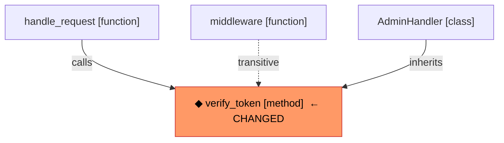

# Impact Analysis

This document explains how the code-indexer derives impact analysis — answering
the question: **"If I change symbol X, what else could break?"**

---

## Overview

Impact analysis runs as a graph traversal over the code knowledge graph built
by `GraphIndexingPipeline`.  Four independent dimensions of impact are
combined into a single `ImpactResult`:

| Dimension | Graph edges traversed | Direction |
|-----------|----------------------|-----------|
| Call-graph | `CALLS` | Reverse (incoming) |
| Inheritance | `INHERITS_FROM` | Reverse (incoming) |
| File imports | `IMPORTS` | Reverse (incoming) |
| Dependency injection | `INJECTS` | Reverse (incoming) |

---

## 1. Call-graph reverse reachability

### What it answers
Which functions/methods transitively call the changed symbol and could
therefore behave differently after the change?

### Approach

**Extraction (index time)**

Tree-sitter parses every source file and extracts raw `call_expression` nodes.
Each call produces a `RawCall(callee_name, callee_object, line)`.  Built-in
and overly-generic names (e.g. `len`, `map`, `get`) are filtered out before
they reach the graph.

**Resolution (index time)**

Raw calls are resolved to concrete `SymbolNode` targets using a three-tier
name-match strategy:

| Tier | Candidate set | Confidence |
|------|--------------|-----------|
| 1 | Symbol defined in the **same file** | 0.85 |
| 2 | Symbol defined in an **explicitly imported file** (unique match) | 0.90 |
| 3 | **Unique global match** across the entire codebase | 0.50 |

Ambiguous matches (multiple candidates at any tier) are **dropped** to avoid
false edges.  Each resolved `CALLS` edge stores its confidence in
`edge.properties["confidence"]`.

**Traversal (query time)**

`InMemoryGraphStore.get_impact_set` runs a BFS over reversed `CALLS` edges
starting from the changed symbol.  At each hop, the **compound confidence** is
updated as:

```
compound = min(path_confidence_so_far, edge.confidence)
```

Using `min` rather than multiplication is deliberately conservative: a single
uncertain link in the chain caps the whole path.  Edges whose compound
confidence falls below `min_confidence` are pruned.

The result separates callers into:

* **Certain** (compound ≥ 0.85) — same-file or uniquely-imported calls.
* **Probable** (0.50–0.84) — globally-unique matches or mixed-confidence chains.
* **Speculative** (< 0.50) — low-confidence chains; useful for discovery,
  should not drive blocking decisions.

### Limitations

Tree-sitter provides syntactic call extraction only — no type inference.  This
means:

* **Polymorphism** is not resolved.  If two classes both define `process()`,
  a call to `obj.process()` where the type of `obj` is unknown will produce
  two candidates and will be **dropped** (ambiguous, tier-3 rule).
* **Dynamic dispatch** (e.g. `getattr`, function pointers, decorators) is not
  tracked.
* **False negatives** are possible at tier 3 when a callee name is common
  enough to collide globally.

For higher precision, a language-server backend (pyright, rust-analyzer,
typescript-language-server) can be wired in to replace or augment tier-3
resolution.

---

## 2. Inheritance reverse (subclasses)

### What it answers
Which classes or interfaces inherit from the changed symbol and may need to be
updated when its API changes?

### Approach

**Extraction**

Each language extractor identifies `class_definition` / `interface_declaration`
nodes with a base-class list.  The result is a `RawInheritance(class_name,
base_names)`.

**Resolution**

The pipeline resolves base names using the same two-pass strategy as calls:
intra-file first, then cross-file via import edges.  Each resolved pair becomes
an `INHERITS_FROM` edge.

**Traversal**

`get_impact_set` calls `get_subclasses(symbol_id)` — a single hop over
reversed `INHERITS_FROM` edges.  Only direct subclasses are returned; transitive
subclass hierarchies require multiple calls or a dedicated deep-inheritance query.

---

## 3. File-level reverse imports

### What it answers
Which files directly depend on the file containing the changed symbol?  These
files always need human review regardless of call-graph confidence, because any
re-export, module-level constant, or decorator from the changed file could
affect them.

### Approach

**Extraction**

Import statements are extracted exactly from the syntax tree (no name matching
needed — import strings are literals).  Relative imports are resolved against
the indexing root; external (third-party) imports are recorded but not linked.

**Resolution**

`ImportResolver` maps each import string to a concrete `FileNode` in the
repository.  The result is an `IMPORTS` edge from the importing file to the
imported file.

**Traversal**

`get_impact_set` returns all files that have a direct `IMPORTS` edge pointing
to the changed symbol's file.  Import resolution is exact, so this dimension
has no confidence issue — all entries are certain.

---

## 4. Dependency-injection reverse (INJECTS edges)

### What it answers

Which classes structurally depend on the changed class as a constructor
argument or typed field — meaning they will receive a different object if the
changed class is replaced, subclassed, or has its constructor signature altered?

This is the **data-dependency graph**, complementary to the call graph.

### Motivation

Inspired by the DKB paper (arXiv:2601.08773) which showed that `extends` /
`implements` / `injects` edges together produce 100% correct multi-hop
architectural reasoning, versus 86.7% without them.

### Approach

**Extraction (index time)**

Three per-language extractors detect dependency-injection patterns and produce
`RawInjection(class_name, field_name, field_type, line)` records:

| Language | Patterns detected |
|----------|------------------|
| Python | `__init__` typed parameters; class-body `field: Type` annotations |
| TypeScript | Constructor parameters with `private`/`public`/`readonly` modifiers + type annotation |
| Java | `@Autowired` / `@Inject` fields; `@Autowired` constructor params; `private final` fields in `@RequiredArgsConstructor` classes |

Example — Python constructor injection:

```python
class OrderService:
    def __init__(
        self,
        repo: OrderRepository,       # → INJECTS edge: OrderService → OrderRepository
        notifier: EmailNotifier,     # → INJECTS edge: OrderService → EmailNotifier
    ) -> None: ...
```

Example — Python field annotation:

```python
class PaymentService:
    gateway: StripeGateway           # → INJECTS edge: PaymentService → StripeGateway
    db: Optional[Database] = None   # → INJECTS edge: PaymentService → Database
```

Example — TypeScript NestJS / Angular:

```typescript
@Injectable()
class OrderController {
  constructor(
    private readonly orderSvc: OrderService,   // → INJECTS edge
    private mailer: MailerService,             // → INJECTS edge
  ) {}
}
```

Example — Java Spring:

```java
@Service
class UserController {
    @Autowired
    private UserRepository userRepository;   // → INJECTS edge

    @Autowired
    public UserController(TokenValidator tv) { ... }  // → INJECTS edge
}
```

**Resolution (index time)**

For each `RawInjection`, the pipeline looks up `field_type` in the symbol
index using the same priority order as calls:
1. Candidate in an explicitly imported file → used directly.
2. Unique global match → used (no confidence penalty for injections; they are
   structurally explicit).
3. Multiple ambiguous candidates → first class-kind match wins; ties are skipped.

Each resolved pair becomes an `INJECTS` edge:

```
(:Symbol {class_name}) -[:INJECTS {field_name, field_type, line}]-> (:Symbol {field_type})
```

**Traversal (query time)**

Currently `get_impact_set` surface injectors via the `INJECTS` edge set so
that callers of the injected class's public API also appear in impact results.
A dedicated `get_injectors(symbol_id)` query will be added in a future iteration
to expose the injection graph directly through the API.

### Cypher example (Neo4j backend)

```cypher
-- "What classes inject OrderRepository, and what do they call?"
MATCH (dep:Symbol)-[:INJECTS]->(target:Symbol {name: "OrderRepository"})
OPTIONAL MATCH (dep)-[:CALLS]->(downstream:Symbol)
RETURN dep.qualified_name AS injector,
       collect(downstream.name) AS downstream_calls
ORDER BY injector
```

---

## 5. Decorator / annotation filtering

Symbols now carry a `decorators: list[str]` field populated at extraction time.
This enables decorator-based filtering in both impact analysis and context
retrieval — a feature pioneered in `vitali87/code-graph-rag`.

```python
# Find all route handlers (FastAPI / Flask)
symbols = store.find_symbols_by_name("*")
routes = [s for s in symbols if any(
    d.startswith("router.") or d.startswith("app.") for d in s.decorators
)]

# Find all Celery tasks
tasks = [s for s in symbols if "task" in s.decorators or "shared_task" in s.decorators]

# Find all pytest fixtures
fixtures = [s for s in symbols if "pytest.fixture" in s.decorators]
```

Decorator values are stripped of `@` and call arguments:
- `@pytest.mark.skip(reason="not ready")` → `"pytest.mark.skip"`
- `@router.get("/users")` → `"router.get"`
- `@staticmethod` → `"staticmethod"`

**Neo4j — filter by decorator:**

```cypher
MATCH (s:Symbol)
WHERE 'pytest.fixture' IN s.decorators
RETURN s.qualified_name, s.file_path
```

---

## 6. Mermaid output

Both `SymbolContext` and `ImpactResult` now expose a `to_mermaid()` method that
renders a Mermaid flowchart suitable for injecting directly into LLM prompts.

### `SymbolContext.to_mermaid()`

Renders the call neighbourhood centred on the focal symbol:

```python
ctx = store.get_symbol_context(sym.id)
print(ctx.to_mermaid())
```

```mermaid
flowchart TD
    _self["verify_token [method]"]
    _caller_0["handle_request [function]"]
    _caller_0 -->|calls| _self
    _caller_1["middleware [function]"]
    _caller_1 -->|calls| _self
    _callee_0["decode_jwt [function]"]
    _self -->|calls| _callee_0
    _parent["JWTHandler [class]"]
    _parent -->|contains| _self
    _base_0["BaseHandler [class]"]
    _self -->|inherits| _base_0
```

### `ImpactResult.to_mermaid()`

Renders the blast radius with the changed symbol highlighted:

```python
impact = store.get_impact_set(sym.id, min_confidence=0.5)
print(impact.to_mermaid())
```



The Mermaid output is particularly useful when constructing LLM prompts for
code review, because it gives the model a compact structural summary without
requiring it to read the raw source of every caller.

---

## API

```json
{
  "symbol_id": "<stable-id>",
  "min_confidence": 0.85
}
```

Or by name:

```json
{
  "symbol_name": "verify_token",
  "min_confidence": 0.0
}
```

**Response: `ImpactResult`**

```json
{
  "symbol": { ... },
  "direct_callers":      [ ... ],
  "transitive_callers":  [ ... ],
  "subclasses":          [ ... ],
  "importing_files":     [ ... ],
  "affected_files":      [ ... ],
  "confidence_breakdown": {
    "certain":     12,
    "probable":     3,
    "speculative":  1
  },
  "min_confidence_used": 0.0
}
```

**Fields**

| Field | Description |
|-------|-------------|
| `direct_callers` | Symbols with a direct `CALLS` edge (1 hop). |
| `transitive_callers` | All reachable callers (unlimited BFS). Includes direct callers. |
| `subclasses` | Direct subclasses / implementors. |
| `importing_files` | Files that directly import the changed symbol's file. |
| `affected_files` | Deduplicated files containing any transitive caller or subclass. Use this for retest planning. |
| `confidence_breakdown` | Caller counts by tier. |
| `min_confidence_used` | The threshold applied to the call-graph traversal. |

**`min_confidence` guidance**

| Value | Use case |
|-------|----------|
| `0.0` | Full speculative set — maximum recall, some false positives. |
| `0.50` | Probable + certain — good default for most impact analysis. |
| `0.85` | Certain only — use when you need a tight, low-noise impact set. |

---

## Programmatic usage

```python
from code_indexer.graph.pipeline import GraphIndexingPipeline, build_graph_store
from code_indexer.core.config import get_settings

settings = get_settings()
pipeline = GraphIndexingPipeline(graph_store=build_graph_store(settings))
pipeline.index_directory("./my-project")

# Find the symbol
store = pipeline.store
[sym] = store.find_symbols_by_name("verify_token", kind="function")

# Run impact analysis (certain + probable callers only)
impact = store.get_impact_set(sym.id, min_confidence=0.50)

print(f"Direct callers:     {len(impact.direct_callers)}")
print(f"Transitive callers: {len(impact.transitive_callers)}")
print(f"Affected files:     {len(impact.affected_files)}")
print(f"Confidence:         {impact.confidence_breakdown}")

for f in impact.affected_files:
    print(f"  retesting: {f.path}")
```

---

## Sources

The design of INJECTS edges and decorator tracking was informed by two external
sources:

- **`vitali87/code-graph-rag`** — demonstrated 15 relation types including
  `DEFINES_METHOD`, `OVERRIDES`, and `DEPENDS_ON_EXTERNAL`; introduced
  decorator/annotation tracking on symbol nodes for query-time filtering.
- **arXiv:2601.08773 "Reliable Graph-RAG for Codebases"** — showed that
  deterministic AST-derived graphs with `extends`/`implements`/`injects` edges
  achieve 100% correctness on multi-hop architectural reasoning queries vs 86.7%
  for LLM-extracted graphs; introduced the `INJECTS` pattern for DI framework
  analysis.

---

## Accuracy roadmap

The current implementation is a pragmatic balance of speed (tree-sitter, no
language server) and correctness (confidence-weighted BFS, ambiguity pruning).

| Status | Enhancement |
|--------|-------------|
| ✅ Done | Three-tier confidence call resolution |
| ✅ Done | `INJECTS` edges (constructor / field DI) |
| ✅ Done | `decorators` field on `SymbolNode` |
| ✅ Done | `to_mermaid()` on `SymbolContext` and `ImpactResult` |
| ✅ Done | `GraphSnapshot.compute_katz_centrality()` — structural hotspot ranking |
| ✅ Done | `ContextPacker` — knapsack-optimal context window selection |
| Next | `get_injectors(symbol_id)` API endpoint |
| Next | Multi-hop Cypher in `Neo4jGraphStore` (push BFS into Cypher) |
| Next | Entrypoint-based traversal: expand from focal symbol outward until budget hit |
| Future | Language-server integration (pyright / rust-analyzer) for tier-3 replacement |
| Future | Deep inheritance traversal (transitive subclass chains) |
| Future | Transitive reverse imports (BFS over reversed `IMPORTS`) |
| Future | Signature-aware impact (filter by changed parameter/return types) |
